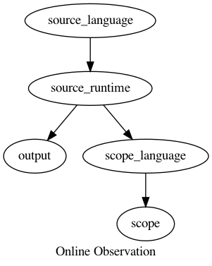

# Architecture

The architecture is designed so that you can use the scope in a few different
ways.

### Online

Inspect the run of a program as it's running.

Maybe there is only a couple data values or data structures that you're actually
interested in, and they don't change very often.  This approach may be helpful.

### Remote

Inspect the run of a program, from a remote system.

Same as online, but the program doesn't need to be running on the same computer
as the scope.

### Offline

Inspect the run of a program, after execution has completed.  The full run of
the program from start to finish is available and allows for interesting
analyses, including selecting a result and determining the dataflow that caused
it.

Since the full execution is available at once, the UI can provide a scrubber
like that in movie editing to fast forward and rewind playback of the execution.

The user could also set breakpoints based on a conditional expression.  However,
sometimes you realize after the fact that the expression needs to be updated.
Unlike traditional debuggers, the user can update the breakpoint's conditional
expression without having to rerun the program.  The full execution is available
at once.  So you can even search for runtime values and instantly see results
and jump to the points in time when that runtime condition was true.

Runtime values can be displayed for all time values, for example, in a graph
with time as an axis, so that the user can see how a runtime value changed over
time during program execution.

## Conclusion

Above are a few of the basic ways to use the scope.  Different modes can be
combined.  For example, a user could use online and remote simultaneously, while
also saving to disk on a remote machine.

# Questions and Answers

What is the source language?

It could be any language that can be run that has runtime state that you'd want
to inspect.  For example, it could be a general purpose programming language
like C, Ruby, or JavaScript, or it could be a domain specific language.

In an ideal scenario, the execution of the source language is not affected,
other than by the time it takes to produce the scope language.  Its computation
and output isn't affected.  This is by design because the whole point of the
scope is to inspect the outcome and internal state of the source program.
